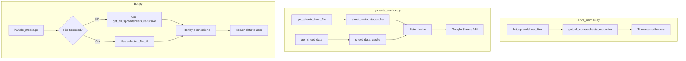

# Phase 1: Bot Enhancement Plan

## Overview
This plan addresses three main improvements for the Telegram bot:
1. Enable searching through subfolders when user asks a question without selecting a file
2. Read all sheets when user doesn't select a specific sheet
3. Optimize API access to prevent 429 quota exceeded errors

## Current Issues

### Issue 1: Subfolder Search
**Location:** `drive_service.py` - `list_spreadsheet_files()`
- Currently only returns files from the root folder specified by `FOLDER_ID`
- Does not traverse into subfolders
- Users cannot access spreadsheets stored in nested folder structures

### Issue 2: Sheet Selection
**Location:** `bot.py` - `handle_message()`
- When user sends a message without selecting a file first, the system uses `get_all_data_from_folder()`
- This reads ALL sheets from ALL files, which is inefficient
- No option to search across all files without reading everything

### Issue 3: API Rate Limiting
**Location:** `gsheets_service.py`
- No caching for `get_sheets_from_file()` - each call hits the API
- No caching for `get_sheet_data()` - each data fetch hits the API
- No rate limiting between requests
- Risk of 429 "Quota exceeded" errors

## Implementation Plan

### 1. Recursive Subfolder Search
**Files to modify:** `drive_service.py`

```python
# Add new function to get all spreadsheets recursively
def get_all_spreadsheets_recursive(folder_id, depth=0, max_depth=10):
    """
    Recursively get all spreadsheet files from folder and its subfolders.
    Returns list of dicts with id, name, and folder_path.
    """
```

**Changes:**
- Add new function `get_all_spreadsheets_recursive()` that traverses all subfolders
- Store folder path for display purposes
- Limit recursion depth to prevent infinite loops

### 2. Caching Layer for Sheet Metadata
**Files to modify:** `gsheets_service.py`

```python
# Add cache for sheet metadata
sheet_metadata_cache = {}

def get_sheets_from_file_cached(file_id):
    """Get sheets with caching - 5 minute TTL"""
```

**Changes:**
- Add in-memory cache with TTL for sheet metadata
- Cache key: file_id
- Cache duration: 300 seconds (5 minutes)

### 3. Caching Layer for Sheet Data
**Files to modify:** `gsheets_service.py`

```python
# Add cache for sheet data
sheet_data_cache = {}

def get_sheet_data_cached(file_id, sheet_name):
    """Get sheet data with caching - 2 minute TTL"""
```

**Changes:**
- Add in-memory cache with TTL for actual sheet data
- Cache key: (file_id, sheet_name)
- Cache duration: 120 seconds (2 minutes)

### 4. Rate Limiting
**Files to modify:** `gsheets_service.py`

```python
# Rate limiting
import time
last_request_time = {}
MIN_REQUEST_INTERVAL = 0.5  # 500ms between requests

def rate_limited_api_call(file_id):
    """Ensure minimum interval between API calls per file"""
```

**Changes:**
- Add minimum interval between API calls (500ms)
- Track last request timestamp per file
- Sleep if necessary to prevent rate limit errors

### 5. Enhance Message Handler
**Files to modify:** `bot.py`

```python
async def handle_message(update: Update, context: ContextTypes.DEFAULT_TYPE):
    # When no file selected, search ALL spreadsheets including subfolders
    # Add option to read all sheets or search specific sheet
```

**Changes:**
- When no `selected_file_id` is set, use recursive search
- Filter results by user permissions
- Add "Read All Sheets" option when no sheet selected

## Architecture Diagram



## File Changes Summary

| File | Changes |
|------|---------|
| `drive_service.py` | Add `get_all_spreadsheets_recursive()` function |
| `gsheets_service.py` | Add caching for metadata and data, add rate limiting |
| `bot.py` | Modify `handle_message()` to use recursive search |

## Testing Checklist
- [ ] Verify subfolder search returns all nested spreadsheets
- [ ] Verify caching reduces API calls for repeated requests
- [ ] Verify rate limiting prevents 429 errors under load
- [ ] Verify permissions are still enforced on recursive results
- [ ] Verify all sheets are read when no sheet is selected
