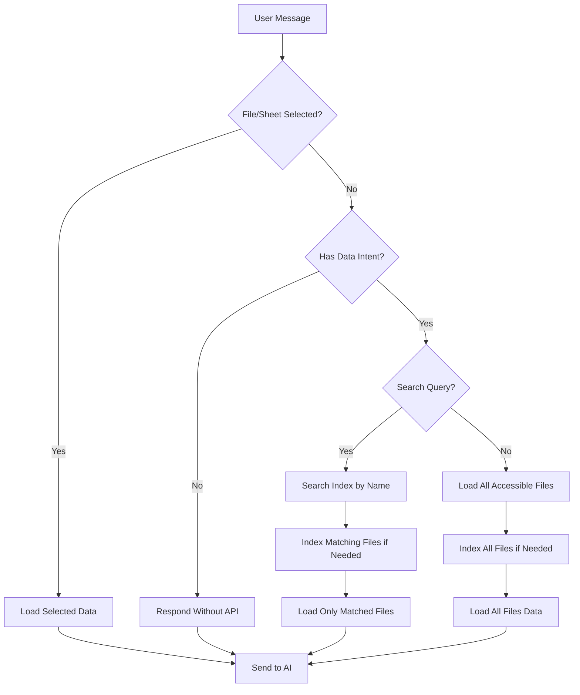

# Spreadsheet API Optimization Plan

## Problem Summary
- Typing "halo" or "saja yang bisa anda lakukan?" triggers 20+ Google Sheets API requests
- Bot caches ALL spreadsheet files even when not needed
- No file/sheet indexing - every query hits the API

## Goals
1. Zero API calls for non-data questions
2. Lazy loading - only cache files when actually accessed
3. File/sheet indexing in database
4. Smart sync - only re-index when Drive content changes

---

## Architecture Design

### 1. Database Schema Changes

Add `spreadsheet_index` table to store file/sheet metadata:

```sql
CREATE TABLE spreadsheet_index (
    id INTEGER PRIMARY KEY AUTOINCREMENT,
    file_id TEXT UNIQUE NOT NULL,
    file_name TEXT NOT NULL,
    folder_id TEXT,
    folder_path TEXT,
    sheet_names TEXT,  -- JSON array of sheet names
    last_modified TIMESTAMP,
    last_indexed TIMESTAMP DEFAULT CURRENT_TIMESTAMP,
    is_active BOOLEAN DEFAULT 1
);

CREATE INDEX idx_file_name ON spreadsheet_index(file_name);
CREATE INDEX idx_folder ON spreadsheet_index(folder_id);
```

### 2. New Service: SpreadsheetIndexService

Location: `access_manager/services/spreadsheet_index_service.py`

Responsibilities:
- Index files and sheets from Google Drive
- Store metadata in SQLite database
- Track `last_modified` from Drive API
- Provide search functionality
- Lazy loading - only index when accessed

Methods:
- `get_or_index_file(file_id)` - Get from DB or fetch from API
- `search_files(query)` - Search by file/sheet name
- `reindex_if_changed()` - Check Drive modification time, re-index if needed
- `index_all_files()` - Full re-index on startup

### 3. Message Handling Flow Changes

```
User Message
    │
    ▼
┌─────────────────────────────────────────┐
│ Check: selected_file_id + selected_sheet │
└─────────────────────────────────────────┘
    │ YES                         │ NO
    ▼                             ▼
┌──────────────────┐    ┌──────────────────────────────┐
│ Load selected    │    │ Check search intent keywords │
│ file/sheet data  │    │ (buka, cari, apa, siapa,     │
└──────────────────┘    │  jumlah, total, dll)          │
                        └──────────────────────────────┘
                            │ YES                │ NO
                            ▼                    ▼
                    ┌───────────────┐    ┌──────────────────┐
                    │ Search index │    │ Simple response  │
                    │ for matching  │    │ NO API calls     │
                    │ files         │    └──────────────────┘
                    └───────────────┘
                            │
                            ▼
                    ┌───────────────┐
                    │ Load only     │
                    │ matched files │
                    └───────────────┘
```

### 4. Search Intent Keywords (Refined)

**Data-seeking keywords** (trigger API):
- 'buka', 'cari', 'search', 'cek', 'tampilkan'
- 'apa', 'siapa', 'dimana', 'berapa'
- 'jumlah', 'total', 'list', 'hitung'
- 'data', 'file', 'sheet', 'laporan'

**Non-data keywords** (NO API):
- 'halo', 'hallo', 'hai', 'hello', 'hi'
- 'terima kasih', 'thanks'
- 'pagi', 'siang', 'sore', 'malam'
- 'bot', 'kamu', 'anda', 'you', 'can', 'do', 'what'

### 5. Lazy Loading Strategy

1. On startup: DO NOT load all files
2. On first access: Index only that specific file
3. On search: Index only matching files
4. Background: Check modification time, update index periodically

### 6. Drive Modification Time Check

Use Google Drive API `files.get` with `fields=id,name,modifiedTime`

```python
def needs_reindex(file_id: str) -> bool:
    """Check if Drive file modified time differs from DB"""
    drive_meta = drive_service.files().get(
        fileId=file_id, 
        fields="modifiedTime"
    ).execute()
    
    db_entry = db.get_spider_file(file_id)
    return db_entry.last_modified != drive_meta['modifiedTime']
```

---

## File Changes

### New Files
- `access_manager/services/spreadsheet_index_service.py` - Index management
- `plans/spreadsheet_optimization_plan.md` - This file

### Modified Files
- `bot.py` - Updated message handling flow
- `access_manager/models/database.py` - Add `spreadsheet_index` table
- `drive_service.py` - Add `get_file_modification_time()`

---

## Implementation Steps

### Phase 1: Database & Index Service
1. Add `spreadsheet_index` table to database schema
2. Create `spreadsheet_index_service.py` with:
   - `index_file(file_id)` 
   - `get_indexed_file(file_id)`
   - `search_files(query)`
   - `sync_with_drive()`

### Phase 2: Bot Message Handler
1. Add non-data keywords list
2. Update message handler logic:
   - If no search intent → respond without API
   - If search → use index to find files
   - If file selected → load that specific file

### Phase 3: Integration
1. Replace `get_all_spreadsheet_files_recursive()` with index-based search
2. Add modification time tracking
3. Implement lazy loading

---

## Mermaid Flow Diagram


